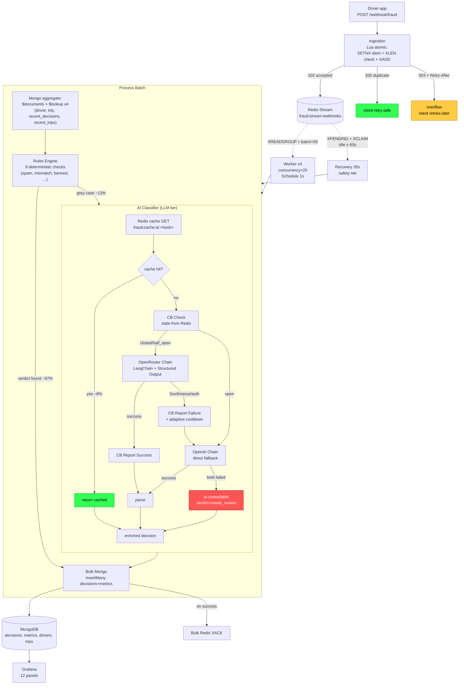
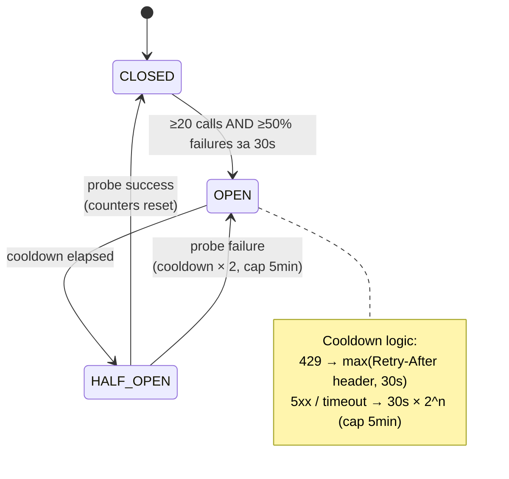
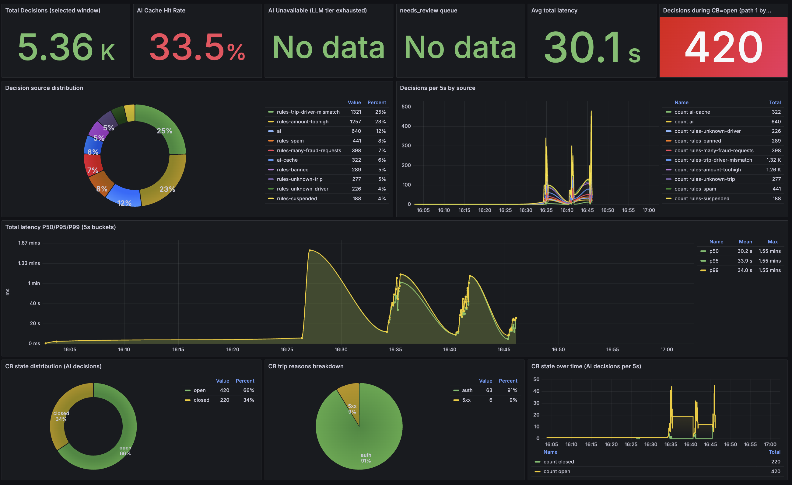
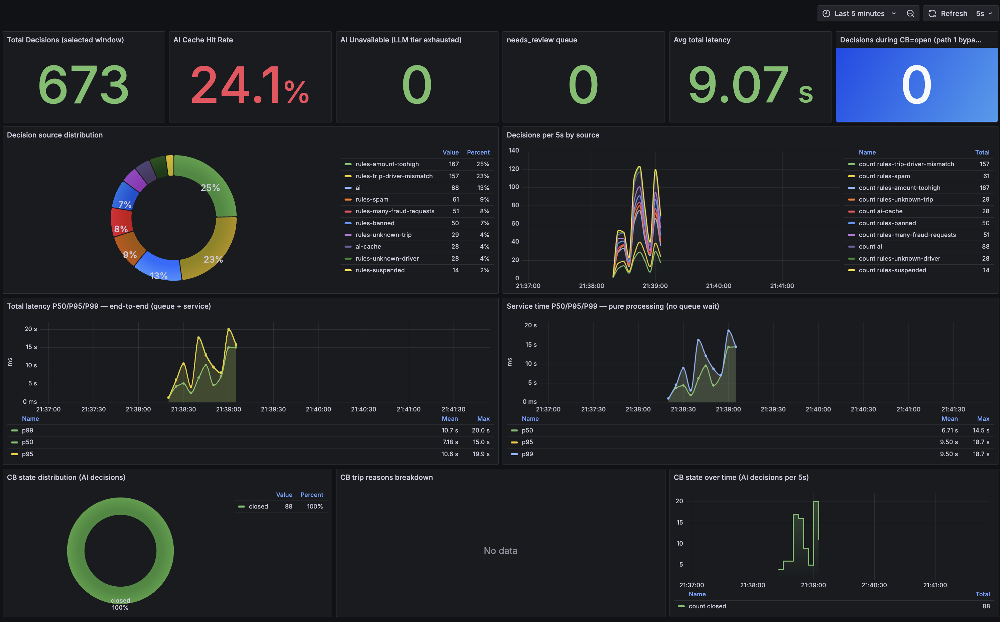

# Fraud Monitoring System

Приймає вебхуки (**до 500 RPS пікового навантаження**), класифікує через детерміновані правила + LLM, зберігає історію та метрики в MongoDB.

> **Стек:** 
> - n8n (queue mode, 4 workers × 20 concurrency) 
> - Redis Streams 
> - MongoDB 
> - OpenRouter (primary LLM) + OpenAI (fallback) 
> - Grafana

## intro

| Name | URL | Access |
|---|---|---|
| n8n | [n8n-test-task.olykov.com](https://n8n-test-task.olykov.com) | передав поштою |
| Grafana | [grf-test-task.olykov.com](https://grf-test-task.olykov.com) | передав поштою |

У n8n editor шість ланцюжків (workflows):

- **Fraud Detection // Ingestion** -> для вебхуків, idempotency, backpressure
- **Fraud Detection // Worker** -> Schedule 1s + pull batch 50 + delegate
- **Fraud Detection // Recovery** -> підбирає stuck pending кожні 30s (XCLAIM idle ≥60s)
- **Fraud Detection // Process Batch** -> sub-workflow: enrich → rules → AI → write+ack
- **Fraud Detection // Rules Engine** -> sub-workflow: 9 правил
- **Fraud Detection // AI Classifier (OpenRouter)** -> sub-workflow з cache + Structured Output + CB

Зручніше їх дослідити на самій платформі, але якщо треда то JSON-експорт усіх шести лежить в `n8n_flows/` цього репозиторію.
<br>Grafana дашборд **«Fraud Monitoring»** має 12 панелей: від `Total Decisions` до `CB state over time`.

## TL;DR
1. **Правила перед AI, не лише як fallback.** -  **9 правил працюють першими** і відкидають очевидні випадки (банальний spam, відомий нам fraud-pattern, mismatch trip-driver (для тесту)). В цьому проекті до LLM доходить **~13% сірої зони** замість 100% трафіку. Економія по cost і по quota.

2. **Backpressure як HTTP-контракт.** При переповненні стріму повертається **`503 + Retry-After: 5`**. Producer бере на себе retry-with-backoff. Альтернативи є: необмежений memory-buffer або DLQ-only (не реалізовано у проекті).

3. **3-шаровий fallback для AI tier.**
   `OpenRouter` (cheap, primary) → `OpenAI direct` (expensive fallback) → `ai-unavailable → needs_review`.
   Між OpenRouter і OpenAI стоїть **Circuit Breaker** з адаптивним cooldown (читаємо `Retry-After` header при 429).

4. **Observable.** `decisions` колекція має `cb_state`, `cb_trip_reason`, `total_latency_ms`, `queue_wait_ms`, `service_time_ms` — Grafana будує панелі прямо з Mongo.

5. **n8n queue mode + 4 workers.** Webhook-handler і обробка через Redis Streams + BullMQ (n8n internal). Дозволяє масштабувати workers.

## Load test
Можна запустити вручну в вашого пк, urls-и і тестові данні вже сконфігуровані. <br>requirements - docker.

<br> Для запуску див. [load-test/README.md](./load-test/README.md)

## Як проходить запит



## Прийом і черга (Backpressure & Idempotency)

Webhook handler — **єдиний атомарний Lua-скрипт** в Redis. За один RTT:

1. **Idempotency:** перевірка `SET fraud:idem:{key} ... NX EX 86400`. Якщо існує — повертаємо 200 з оригінальним `request_id`. Дублікати webhook не створюють зайвих записів.
2. **Backpressure:** `XLEN fraud:stream:webhooks ≥ MAX_QUEUE_LEN (100k)` → запис у DLQ + повертаємо `503 + Retry-After: 5`. Не claim-имо idem-ключ — клієнт може робити retry.
3. **Enqueue:** `XADD * request_id ... payload ... enqueued_at ...`.

Чому атомарно: між кроками 1-3 не повинно бути race condition (два worker процеси не повинні створити дві паралельні decisions для того самого `idempotency_key`).

## MongoDB (single aggregation)

`Process Batch` тригерить **одну** aggregation pipeline на батч 50 (батч можемо міняти але 50 оптимально в цьому сетапі):

```js
db.aggregate([
  { $documents: virtualDocs },
  { $lookup: drivers   ... },
  { $unwind: '$_driver' },
  { $lookup: trips     ... },
  { $unwind: '$_trip' },
  { $lookup: recent_decisions (last 5) },
  { $lookup: recent_trips (last 5)     },
  { $project: enriched_form }
])
```

Один RTT в Mongo для збагачення batch. Альтернатива без агрегації — у 200 разів дорожче.

## AI Orchestration

LLM повертає **строгий JSON** валідований через `Structured Output Parser` (LangChain) з explicit JSON Schema:

```json
{
  "verdict": "fraud" | "legitimate" | "uncertain",
  "risk_score": "number 0-1",
  "reasoning": "short string",
  "key_factors": ["string", ...]
}
```

**Cache key (Variant A — driver-state-aware):**
```
sha256(driver_id | trip_id | claimed_amount | normalized_text |
       account_status | flags | fraud_count_lifetime)
```

Включає state драйвера → інвалідується автоматично коли драйвер змінив flags / отримав fraud strike. Запобігає stale verdicts. Наприклад це може стати в нагоді коли suspended статус додався чи знявся між запитами.

## Circuit Breaker

Захищає pipeline від каскадних збоїв LLM-провайдерів. State machine в Redis hash `fraud:cb:openrouter`:



**Trip reasons** парсимо з error response: `429`, `5xx`, `timeout`, `auth`. Поле `cb_trip_reason` зберігається в кожному decision-документі — Grafana показує breakdown - робимо висновки чи алєрти.

**Adaptive cooldown через `Retry-After`** — якщо OpenRouter віддає 429 з `Retry-After: 60`, CB тримає open на 60s, не на дефолтних 30s. - це про адаптивний cooldown.

**Fail-open semantics:** якщо сам Redis CB-check впав — pipeline **не блокується**, запит йде в OpenRouter.

## Observability — Grafana
| Group | Panels |
|---|---|
| **Top stats** | Total Decisions · Cache Hit Rate · AI Unavailable · needs_review · Avg latency · **Decisions during CB=open** |
| **Sources** | Decision source distribution (donut) · Decisions per 5s by source (timeseries) |
| **Latency** | Total P50/P95/P99 (queue+service) · **Service time P50/P95/P99 (pure processing)** |
| **Circuit Breaker** | CB state distribution · CB trip reasons · CB state over time |

Навмисно розділена `total_latency_ms` (UX-перспектива) і `service_time_ms` (внутрішній throughput). Під burst-ом перший може бути 16s через queue wait — а реальний processing на batch (50 елементів) ~10s. Це дає ясність куди дивитись при оптимізації: 
- зростає queue wait → масштабємо workers / batch; 
- зростає service → оптимізуй AI tier чи Mongo.

## Load test Результати
Тестував локально і на віддаленому сурвері (прод на віддаленому)

**50 RPS sustained (4 workers × conc 20, BATCH=50):**

| Метрика | Значення |
|---|---|
| Decisions persisted | 1360 / 1380 accepted |
| **Lag during k6** | **0 (real-time processing)** |
| Stuck pending | 0 |
| Drain after k6 | 5-10s |
| Crashed executions | 0 |

**500 RPS burst:**

| Метрика | Значення |
|---|---|
| Webhooks accepted | 1810 |
| Overflow 503 | 1494 (backpressure) |
| Decisions persisted | 1810 (delta = accepted, без втрат) |
| Crashed executions | 0 |
| Drain after k6 | ~50s |
| **avg_total_latency** | 16.0s (queue 5.5s + service 10.5s) |
| **p95 service_time** | 15.5s |
| CB trips during burst | 0 (transient failure rate 3.3% < 50% threshold) |

**500 RPS burst + manually deactivated OpenRouter key (CB demo):**

| Метрика | Значення |
|---|---|
| CB trip cycles | 6 (closed→open→half_open) |
| Decisions під CB=open | 187 (path 1 bypass to OpenAI direct) |
| ai-unavailable приріст | **0** (всі через OpenAI) |
| Trip reasons | 100% `auth`(ок) |

CB відпрацював відмову primary провайдера, бізнес-логіка не деградує.

### Скріншоти Grafana





## Бізнес-метрики

| Метрика | Формула |
|---|---|
| **Cost per decision** | `(LLM tokens × price) / decisions` |
| **Cache hit rate** | `ai-cache decisions / AI calls` | 
| **Automation rate** | `(decisions - needs_review) / total` |
| **False-positive rate** | `(operator-overrides на fraud-вердикти) / fraud-вердикти` |
| **p95 latency під SLA** | timeseries з alert-ом |

## Scaling до 5000 RPS

Поточна конфігурація цього не може:

#### 1. n8n-main webhook handler (~88 RPS effective)

Single Node.js process приймає всі вебхуки. Це межа на ingestion.

**Рішення:** лоад балансер + dedicated webhook processors n8n queue mode:
- _n8n підтримує `n8n webhook` mode (окремі процеси тільки для прийому). N=5 webhook процесів × ~100 RPS кожен = ~500 RPS sustained ingestion. Для 5000 RPS — N=50._

#### 2. Workers

При 4 workers × concurrency 20 + batch=50, drain ~50-200 RPS. Для 5000 RPS:

- **Workers → 20-30** горизонтально;
- **Concurrency 50+** per worker, але треба сильніше пропрацювати рейт ліміти OpenRouter;
- **MongoDB sharding** на `request_id`

#### 3. Cost
При 5000 RPS × 13% AI = 650 LLM calls/sec. Без кешу і без правил це ~$2-5k/день на gemini-flash-lite. Тому правила перед AI — **найдешевша оптимізація** з усіх можливих.

## Human-in-the-Loop (HITL)
Decisions з `verdict=needs_review` (грей-зона AI або ai-unavailable) йдуть в окрему чергу:

```
needs_review queue → Operator UI →
   ├ approve / reject (final verdict)
   └ feedback annotation → training set
```

Архітектурні точки:

- **Operator UI** — окремий сервіс 
- **Feedback loop:** оператор дає рішення і анотую його.
- **Метрика якості:** `agreement_rate = (operator approves AI verdict) / total_reviewed`. Падає <80% → AI prompt потребує тюнінгу.

Далі є варінти: RAG на цих днних, пошук, насичення інформації - доп контекст для LLM.
Або збираємо в датасет, тюнимо моделі (не найкраща опція).

## TODO

1. **Token bucket rate limiter** для OpenRouter (Lua atomic в Redis) — не 100% але для проду і навантаження треба.
2. **n8n webhook processors** + nginx LB - для повних 500+-5000 RPS ingestion.
3. **LangChain нода > HTTP** — щоб мати status code + headers.
